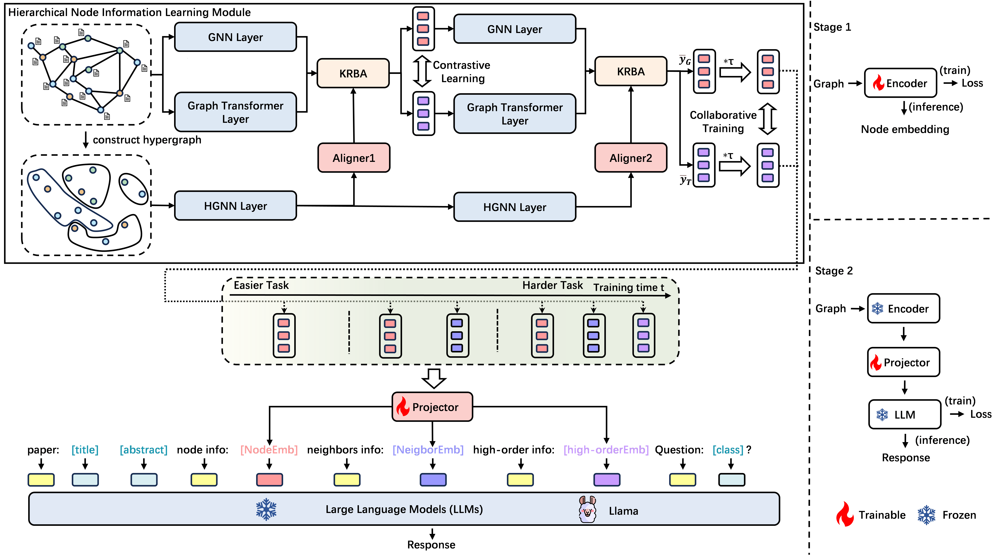

  GTA: A Graph-Text Alignment Framework for Optimizing Node Representations and Enhancing LLM Integration </h2>

 

## If you find this work useful for your research, please kindly cite our paper and star our repo.

## Introduction

This is the github repository of *GTA: A Graph-Text Alignment Framework for Optimizing Node Representations and Enhancing LLM Integration*. In this work, we propose a Graph-Text Alignment Framework for Optimizing Node Representations and Enhancing LLM Integration (GTA). This advanced framework adeptly integrates information from hierarchical levels of nodes to refine node representations for input to LLMs, and employs a specialized training strategy to enhance the alignment of graph data with LLMs.

## Installation

### Environment

## Checkpoints

## Usage

### Prepare models

### Inference

## Evaluation results

## Qualitative Comparison

## More Examples
## Acknowledgement
Our code is largely based on [CoBFormer](https://github.com/null-xyj/CoBFormer), [GraphPromper](https://github.com/franciscoliu/graphprompter). Thanks for their work.
## Citation

If you find this work useful for your research, please kindly cite our paper
